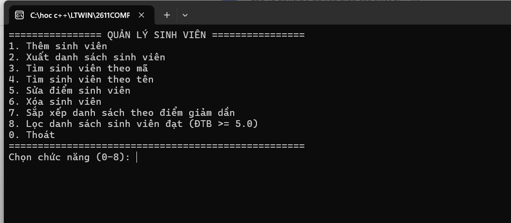
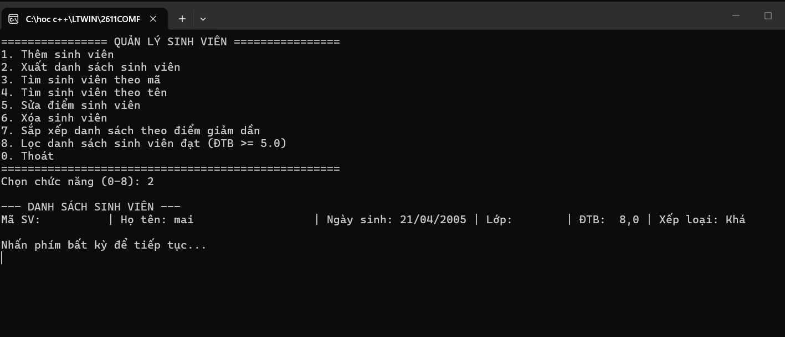

Lab03

Mo ta: Viết chương trình Console quản lý sinh viên theo hướng đối tượng. Chương trình cho phép người dùng thao tác với 
danh sách sinh viên thông qua menu. Dữ liệu được lưu trong bộ nhớ bằng List<SinhVien>.

### hình ảnh 1: menu

### hình ảnh 2: them sinh vien & hien thi danh sach sinh vien

